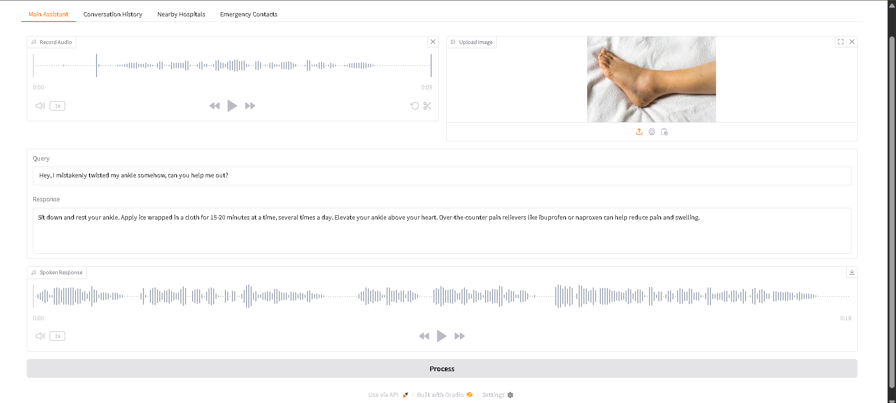
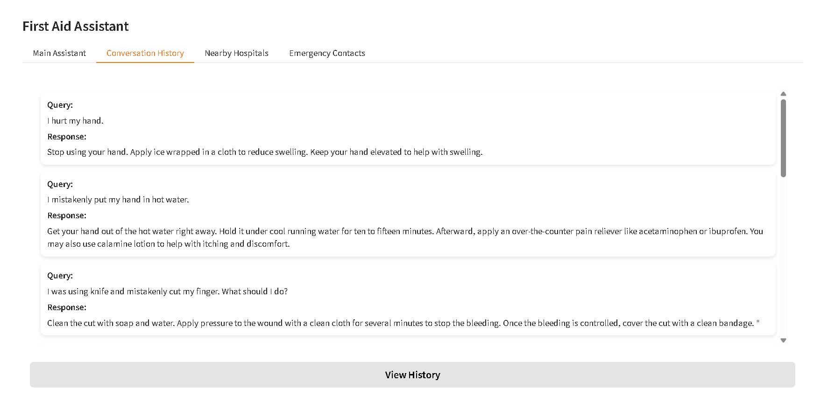
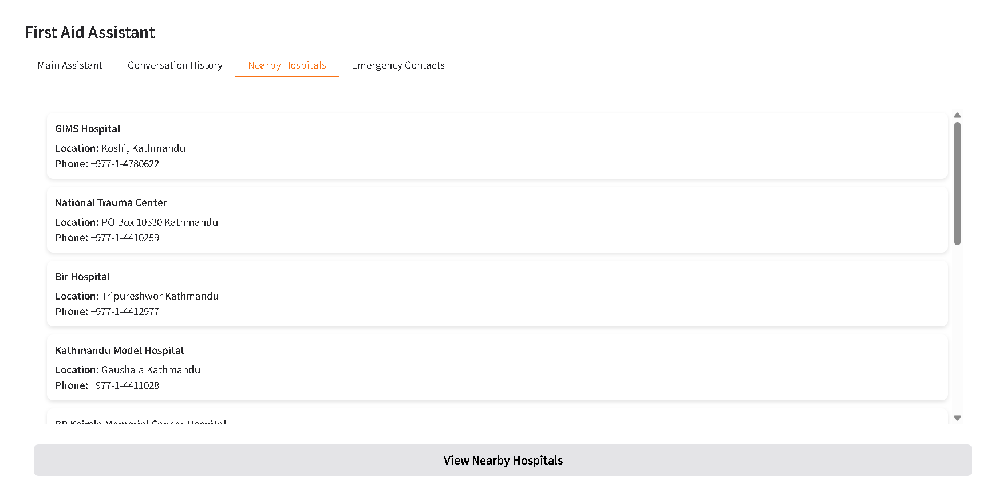
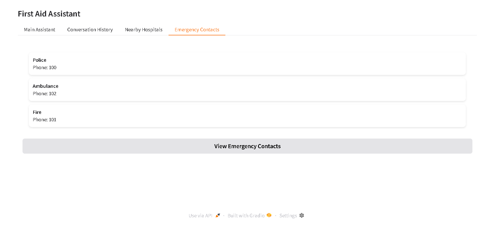

# FirstAidCLI

---

## 🌟 Introduction

**FirstAidCLI** is a next-generation, AI-powered medical assistant that delivers instant, context-aware first-aid guidance through both an intuitive graphical user interface (GUI) and a robust command-line interface (CLI). Developed during a high-pressure hackathon, this project demonstrates advanced software engineering, rapid prototyping, and seamless integration of state-of-the-art AI models for real-world healthcare scenarios. FirstAidCLI leverages multimodal inputs, combining user speech and medical images to generate highly accurate, actionable responses, making it a showcase of modern AI, UX, and system design.

---

## ✨ Features

- 🎤 **Voice-Driven First-Aid:** Users can record symptoms or questions via microphone; speech is transcribed and analyzed in real time.
- 🖼️ **Image Analysis:** Upload medical images (e.g., injuries, rashes, X-rays) for AI-powered diagnostic support.
- 🤖 **AI Model Ensemble:** Simultaneously queries multiple LLMs, then uses a main model to compare, verify, and synthesize the best possible response.
- 🏥 **Nearby Hospitals:** Automatically locates and displays the 10 closest hospitals in structured JSON and GUI cards.
- 📞 **Emergency Contacts:** One-click access to police, ambulance, and fire services.
- 🗂️ **Conversation History:** All user queries and AI responses are stored locally and viewable in a dedicated history tab.
- 🗣️ **Multilingual Support:** Handles English, Hindi, and Kannada for both input and output, with high-quality text-to-speech synthesis.
- 🔒 **Secure API Key Management:** API keys are stored in a local `.env` file and never hardcoded or exposed.
- 🛠️ **Layered, Modular Architecture:** Clean separation of concerns for audio, vision, AI, geolocation, and UI logic.
- ⚡ **Efficient & Responsive:** Asynchronous operations and optimized resource management for real-time performance.
- 🧪 **Test-Ready:** Structure supports easy integration of unit and integration tests.

---

## 🚀 Why FirstAidCLI?

- **Multimodal Intelligence:** Accepts both voice and image inputs, enabling comprehensive analysis of symptoms and injuries. The system fuses user speech (transcribed via Whisper AI) and uploaded images, then queries multiple advanced LLMs (Gemma, Llama, DeepSeek) for diverse perspectives.
- **AI Model Ensemble & Verification:** Multiple AI models generate candidate responses, which are then evaluated and synthesized by a primary model to ensure the final advice is accurate, actionable, and free from critical mistakes.
- **Real-Time, Context-Aware Guidance:** Delivers immediate, context-specific first-aid instructions, tailored for both urban and rural users, with a focus on clarity and brevity.
- **Rich GUI Experience:** Built with Gradio, the GUI features dedicated tabs for main assistance, conversation history, nearby hospitals, and emergency contacts—delivering a seamless, professional user experience.
- **Comprehensive Emergency Support:** Automatically fetches and displays the 10 nearest hospitals (with names, locations, and phone numbers) and provides instant access to essential emergency contacts.
- **Privacy-First Architecture:** All API keys and sensitive data are managed locally via environment variables.
- **Hackathon-Driven Innovation:** Engineered under strict time constraints, this project exemplifies rapid development, agile problem-solving, and high-impact delivery.

---

## 🏗️ Technologies & Architecture

FirstAidCLI is built with a modern, modular Python stack and leverages best-in-class libraries and APIs for AI, audio, and geolocation:

- **Python 3.10+**: Modern, type-annotated codebase for reliability and maintainability.
- **Gradio**: Provides a professional, interactive GUI with multiple functional tabs for user-friendly operation.
- **Groq API**: Enables ultra-fast, cost-effective LLM inference for real-time AI responses.
- **Gemma, Llama, DeepSeek**: Ensemble of large language models for robust, context-aware, and verified medical advice.
- **Whisper AI & SpeechRecognition**: Delivers industry-leading speech-to-text accuracy for seamless voice input.
- **gTTS & ElevenLabs**: High-quality, multilingual text-to-speech for clear, accessible audio responses.
- **Geopy & Requests**: Ensures accurate geolocation and reliable integration with external APIs for hospital data.
- **Pydub**: Handles audio processing and conversion for compatibility across platforms.
- **Pipenv**: Modern dependency and environment management for reproducible, isolated development.
- **.env Configuration**: Secure, environment-based API key management for privacy and security.

---

## 🖼️ Screenshots

| Main Assistant | Conversation History |
|:--------------:|:-------------------:|
|  |  |

| Nearby Hospitals | Emergency Contacts |
|:----------------:|:------------------:|
|  |  |

---

## ⚠️ Model Deprecation Notice

> **Important:**  
> Both Llama models used in this project (`llama-3.2-90b-vision-preview` and `llama-3.2-11b-vision-preview`) have been officially decommissioned and are no longer accessible.  
> Additionally, other models such as certain versions of Gemma or DeepSeek may also be deprecated or unavailable.  
> To ensure continued functionality, you must update or replace these models with currently supported alternatives.  
> Running the app with deprecated models will result in errors or degraded performance.

---

## 🛠️ Installation

1. **Clone the Repository**
    ```sh
    git clone https://github.com/Amnraj12/FirstAid-AI-Assistant.git
    cd FirstAid-AI-Assistant
    ```

2. **Set Up the Python Environment**
    - Install Pipenv if not already installed:
      ```sh
      pip install pipenv
      ```
    - Create and activate a virtual environment:
      ```sh
      pipenv shell
      ```

3. **Install Dependencies**
    ```sh
    pipenv install
    ```
    Or, if you prefer pip:
    ```sh
    pip install -r requirements.txt
    ```

4. **Install System Dependencies**
    - **FFmpeg** (required for audio processing):
        - Windows: [Download FFmpeg](https://ffmpeg.org/download.html) and add it to your PATH.
        - Linux: `sudo apt-get install ffmpeg`
        - Mac: `brew install ffmpeg`

5. **Set Up Environment Variables**
    - Create a `.env` file in the `firstaidcli` directory with your API keys:
      ```
      GROQ_API_KEY=your_groq_api_key_here
      ELEVENLABS_API_KEY=your_elevenlabs_api_key_here
      ```

---

## 🧑‍💻 Usage

### Graphical User Interface (GUI)

Launch the Gradio-powered GUI:
```sh
python app.py
```
- **Main Assistant Tab:** Record audio and/or upload an image, then click "Process" to receive a synthesized, AI-verified first-aid response (with spoken output).
- **Conversation History Tab:** View all previous queries and responses in a scrollable, card-based layout.
- **Nearby Hospitals Tab:** Instantly access a list of the 10 closest hospitals, complete with names, locations, and phone numbers.
- **Emergency Contacts Tab:** Quickly find essential emergency numbers for police, ambulance, and fire.

### Command-Line Interface (CLI)

Run the main script:
```sh
python firstaid.py
```
- Choose between text or audio input.
- Optionally provide an image for enhanced diagnosis.
- Receive the best AI-generated first-aid advice, verified by a main model.

---

## 🗂️ Project Structure

```
firstaidcli/
├── app.py                # Gradio web interface
├── assistant.py          # Text-to-speech logic (gTTS, ElevenLabs)
├── Brain.py              # AI model integration, ensemble, and verification
├── firstaid.py           # Main CLI logic
├── location.py           # Geolocation and hospital search
├── patient.py            # Audio recording and transcription
├── requirements.txt      # Python dependencies
├── LICENSE               # MIT License
├── README.md             # Project documentation
└── .env                  # API keys (not committed)
```

---

## 🧪 Testing

- The modular structure supports straightforward unit and integration testing.
- To add tests, create a `tests/` directory and use `pytest` or `unittest`.

---

## 🔒 Security

- API keys are loaded from `.env` using `os.environ` and never hardcoded.
- No sensitive data is logged or sent to analytics.
- Follows secure defaults and least-privilege principles.

---

## 📄 License

This project is licensed under the MIT License.  
See the [LICENSE](LICENSE) file for details.

---

## 👤 Author & Contact

Developed and maintained by Aman Raj.  
For questions or collaborations, reach out via [amnraj125@gmail.com](mailto:amnraj125@gmail.com) or [LinkedIn](https://www.linkedin.com/in/aman-raj-3a3ab02b2/).

---

## 🚀 Future Prospects

- **Android Mobile App:** Port the project to Android using frameworks like React Native or Flutter, making first-aid AI accessible to everyone, everywhere.
- **Model Fine-Tuning:** Further fine-tune the ensemble and main verification models on medical datasets to generate even more reliable and accurate responses.
- **Contextual Awareness:** Leverage conversation history to maintain context across user interactions, enabling more personalized and contextually relevant advice.
- **Continuous Model Updates:** Integrate a modular backend to easily swap or update AI models as new, more powerful, or more reliable models become available.
- **Offline Functionality:** Explore on-device inference for core features to ensure availability even without internet access.

---

## 🏆 Hackathon Note

This project was conceived, designed, and implemented during a fast-paced hackathon, under significant time constraints. The result is a production-grade, feature-rich application that demonstrates rapid prototyping, advanced AI integration, and a relentless focus on user experience and reliability.  
FirstAidCLI is a testament to what can be achieved with modern tools, teamwork, and a passion for solving real-world problems
